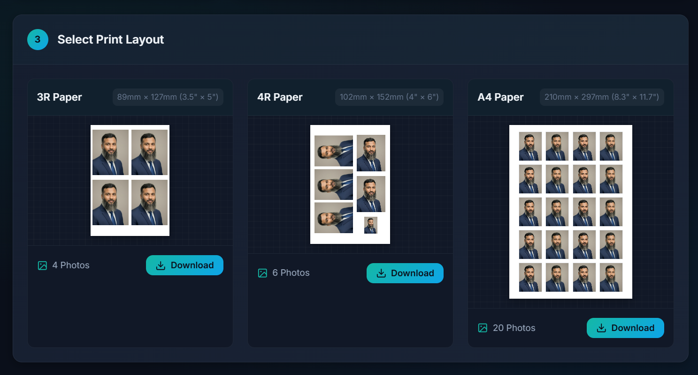

# Passport Photo Print

A simple, fast, and secure web application to create and print passport-size photos effortlessly. Optimized for Bangladesh passport standards with support for 3R, 4R, and A4 paper layouts.



## Features 🚀

- **Smart Upload:** Drag & drop photo upload with support for JPG, PNG, and WEBP.
- **Perfect Crop & Adjust:** Automatic centering with zoom (up to 1000%) and pan controls. No auto-cropping; full control over the image.
- **Layouts:**
  - **3R (3.5" x 5"):** 4 Photos (Standard Grid / Photoshop Picture Package Layout).
  - **4R (4" x 6"):** 6 Photos (Mixed Layout: 5 Passport + 1 Stamp size).
  - **A4 (8.3" x 11.7"):** 20 Photos (Standard Grid).
- **Single Cut Ready:** Smart layout design with 2mm padding around photos, allowing for a single cut to separate images without double trimming.
- **High Quality:** Outputs usually at 300 DPI for professional print quality.
- **Privacy First:** Client-side processing. Your photos never leave your browser.

## Tech Stack 🛠️

- **HTML5 & CSS3:** Modern, responsive UI with CSS Grid and Flexbox.
- **JavaScript (Vanilla):** Core logic for image processing, canvas manipulation, and DOM interaction.
- **Canvas API:** For high-performance image rendering and layout generation.

## How to Use 📝

1. **Select Country:** Defaults to Bangladesh (Standard 40mm x 50mm).
2. **Upload Photo:** Click or drag your photo into the upload area.
3. **Adjust:** Use the zoom slider and drag the image to position it perfectly within the frame.
4. **Download:** Scroll down to select your paper size (3R, 4R, or A4) and click "Download".
5. **Print:** Print the downloaded image on the respective photo paper size without scaling (100% scale).

## Local Development 💻

1. Clone the repository:
   ```bash
   git clone http://github.com/royal-technologies/passportphotoprint
   ```
2. Open `index.html` in your browser.
   - Or serve using a local server like Live Server or `php -S localhost:8000`.

## License 📄

© 2026 [Royal Technologies](https://www.royaltechbd.com/). All rights reserved.
